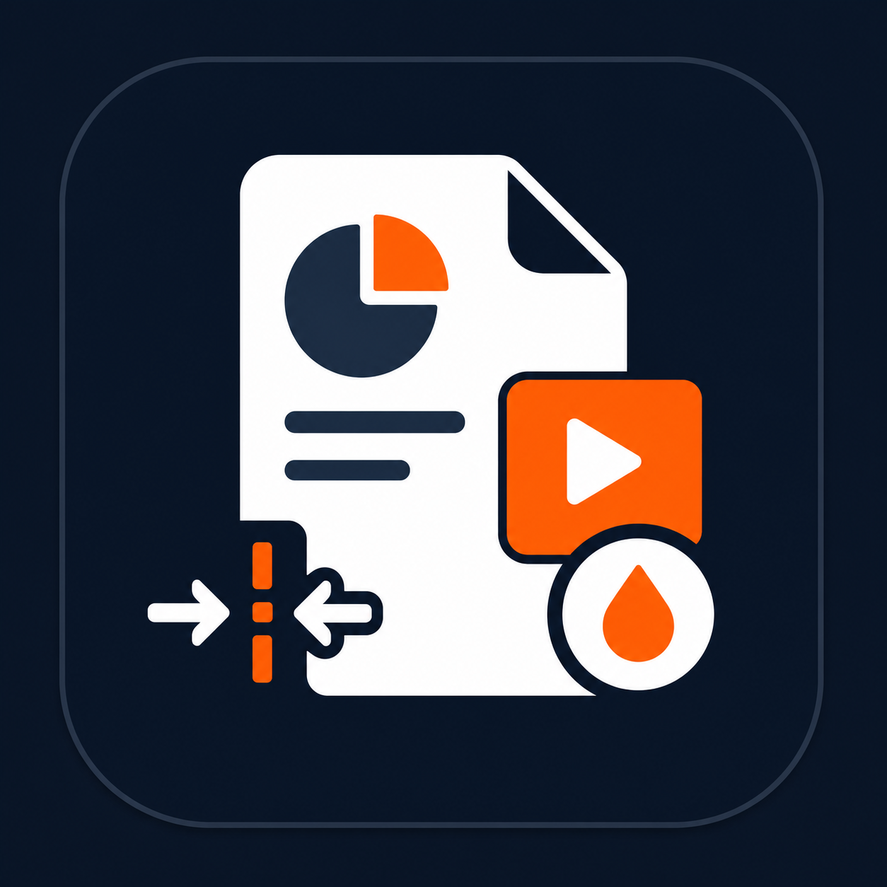
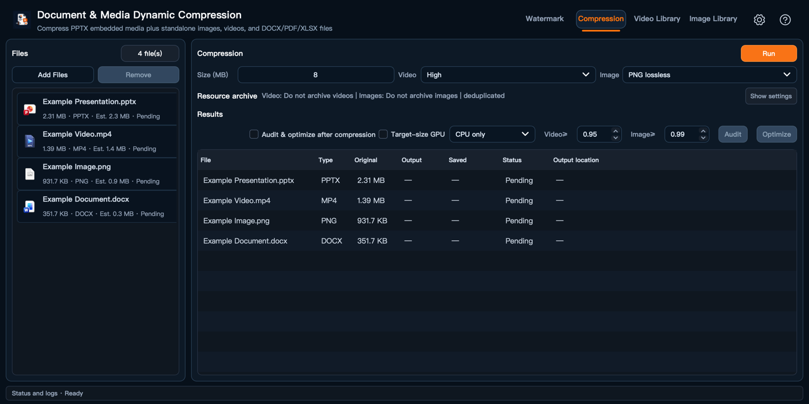
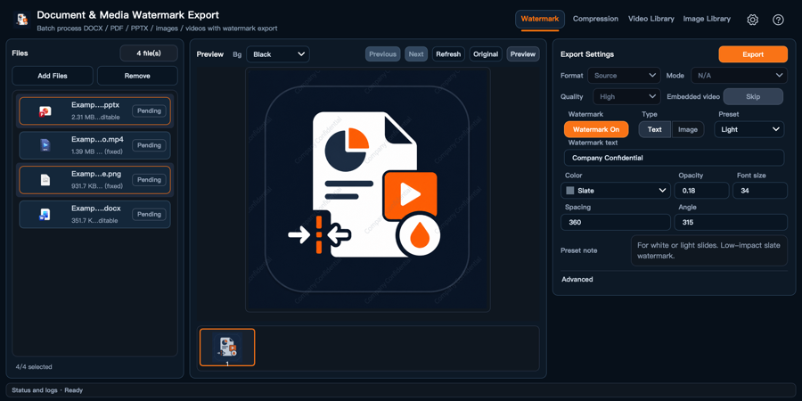
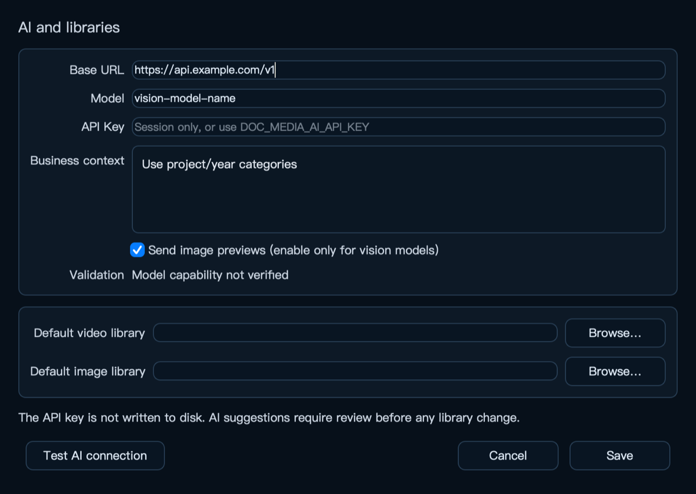

<div align="center">
  
  <h1>Doc Media Toolkit</h1>
  <p><strong>让过大的 PPTX 安全减负，并把文档中的视频和图片变成可管理、可复用的资产。</strong></p>

  [English](README.md) · 简体中文

  [](#项目状态)
  [](docs/INSTALL.zh-CN.md)
  [](src/pptx_tools/__init__.py)
  [](pyproject.toml)
  [](#快速开始)
  [](LICENSE)
</div>



<p align="center"><sub>当前源码的实际运行界面；截图使用隔离设置和匿名合成测试文件，不包含真实项目、路径或业务素材。</sub></p>

## 它解决什么问题

PPTX 很容易因为内嵌视频和高分辨率图片变得过大，手工压缩又难以兼顾目标容量、播放兼容性和画质。相同媒体散落在多个文档中，还会重复占用本地空间，原始高清素材也容易失去统一管理。

Doc Media Toolkit 面向这类文档媒体工作流：

- 按预设或目标容量压缩 PPTX 内嵌视频和图片，并结合显示面积、复用情况和素材特征分配压缩预算。
- 压缩后自动评估画质；低于阈值的素材可以提档重压，避免只追求体积而明显劣化。
- 将 PPTX 等文件中的视频和图片归档为统一资产，精确去重、保留来源与版本关系，并支持安全回填高清媒体。
- 可选借助兼容 AI 模型整理、重命名、分类和标记视频与图片；模型支持视觉时可在用户确认后分析预览图，所有结果仍是待审核建议。
- 生成带文字或图片水印的图片型 PPTX，并可对内嵌视频加水印后按原位置回贴。
- 兼容 DOCX、PDF、XLSX、独立图片和视频等常见输入，作为同一套文档处理流程的补充能力。

## 核心能力

| 能力 | 主要用途 |
| --- | --- |
| 智能目标压缩 | 以 PPTX 为核心，支持目标容量、视频/图片独立预设、CPU/GPU 策略、SSIM 画质评估和提档优化 |
| 视频与图片资产库 | 从文档归档媒体、SHA-256 精确去重、保守识别不同编码版本、维护来源关系并安全回填 |
| AI 辅助整理 | 可选生成命名、分类、标签和候选归并建议；视觉输入仅在模型支持且用户启用时发送预览 |
| 水印导出 | 批量导出 PDF/PPTX/图片/视频，支持文字或图片水印、图片型 PPTX 和内嵌视频水印回贴 |
| 本地优先与安全操作 | 默认另存输出；相似候选、AI 建议、归并和清理均需人工确认，清理前先进入可恢复隔离区 |

本项目不是通用视频或图片编辑器。视频和图片处理主要服务于文档减负、可播放交付和媒体资产管理。

## 范围与能力边界

| 领域 | 状态 | 边界 |
| --- | --- | --- |
| PPTX 媒体压缩 | 核心 | 以目标容量规划、画质保护和 CPU/GPU 视频路径为主要工作流。 |
| 水印导出 | 核心 | 支持图片型 PPTX 以及文档、图片、视频水印；默认不改写源文件。 |
| 视频资产库 | 核心 | 归档、去重、追踪并回填文档视频源，匹配策略偏保守。 |
| DOCX / PDF / XLSX 媒体处理 | 支持 | 使用格式专用后端，必要时依赖外部 Office/PDF 运行时；保持版式和文字，不做完整文档重排。 |
| 图片资产库 | 附加 | 支持常见图片工作流，但验证深度低于 PPTX/视频核心路径。 |
| AI 整理 | 可选 | 只生成可审核的命名、标签和分组建议，不会静默重命名、合并或删除资产。 |
| 通用编辑、云同步和 OCR | 范围外 | 这些任务应使用专用编辑器、存储服务或 OCR 工具。 |

## 界面预览

### 水印导出



### AI 与资源库设置



以上均为当前源码的真实运行界面，使用匿名合成文件和无效示例配置；不包含真实项目、API Key、本机路径或业务素材。

## 快速开始

> [!IMPORTANT]
> 源码版本可以使用。macOS 和 Windows 预构建包目前作为候选产物保留，签名及产物级
> 许可门禁通过前不公开。

推荐使用 Python 3.12。源码环境会安装所需 Python 包；FFmpeg、Poppler 和办公软件
运行时按所用功能与平台选择。已验证平台、外部运行时、升级备份和安装包可信状态见
[安装与平台支持](docs/INSTALL.zh-CN.md)。

macOS / Linux：

```bash
git clone https://github.com/roanpy/doc-media-toolkit.git
cd doc-media-toolkit
bash setup_env.sh
.venv/bin/pptx-tools-gui
```

Windows PowerShell：

```powershell
git clone https://github.com/roanpy/doc-media-toolkit.git
cd doc-media-toolkit
py -3.12 -m venv .venv
.venv\Scripts\Activate.ps1
python -m pip install -e ".[dev,build]"
pptx-tools-gui
```

CLI 兼容名仍为 `pptx-tools`：

```bash
pptx-tools --help
pptx-tools compact --help
pptx-tools watermark --help
pptx-tools videos --help
pptx-tools images --help
```

## 安全与隐私

- 普通处理默认生成新文件，不覆盖源文档。
- 视频库和图片库的移除、合并与清理先进入可恢复隔离区。
- 文件名、目录、时长或分辨率不能单独证明两个素材相同；不满足严格条件时必须人工核对。
- AI 整理建议为可选能力。API Key 只保留在当前进程；默认不发送完整文档、完整视频或本机路径。
- 正式 DMG/EXE 不是“仅 MIT”产物，发布前还需完成 Qt、FFmpeg、PDFium、Python 和平台原生库的产物级许可审计与签名。

详见[依赖说明](docs/DEPENDENCIES.md)、[许可与二进制分发说明](docs/LICENSING.md)和[安全政策](SECURITY.md)。

## 项目状态

当前源码版本标识为**稳定版 0.2.2**。PPTX 压缩、水印、视频资产库及主要文档兼容能力已经过确认；图片资产管理是附加能力，尚未完成与核心功能同等级的深度实测。主窗口、水印、压缩和帮助中心支持简体中文与英文；视频库和图片库目前仍以中文为主。支持双语的工作区首次启动会跟随系统界面语言，也可在启动前设置 `PPTX_TOOLS_LANG=zh` 或 `PPTX_TOOLS_LANG=en` 强制切换。

公开仓库和 Python 分发名均为 `doc-media-toolkit`；Python 导入包仍为 `pptx_tools`，CLI 继续保留 `pptx-tools` / `pptx-tools-gui`，因此已有脚本无需修改。分发名调整用于避开 PyPI 上已有的同名无关项目。0.2.0 的 DMG/EXE 候选在产物审计后已撤回，禁止重新公开；替换安装包必须使用 0.2.2 或更高版本。剩余阻塞包括 Developer ID/公证或 Authenticode 签名、目标平台恶意软件扫描证据、产物级 SBOM/原生库清单和 Windows Qt 分发路径。仓库已提供失败关闭的证据工具，并保留固定来源的 FFmpeg 对应源码包；工具不会把未扫描的本地候选包变成正式公开包。详见[候选产物审计](docs/releases/v0.2.0-candidate-audit.md)。

替换候选不再复用 Homebrew/Gyan FFmpeg 二进制：正式构建以 SHA-256 固定 FFmpeg 8.1.2、x264 与 zlib 1.3.2 源码，保留 libx264、macOS VideoToolbox 和 Windows Media Foundation 编码，并为每个平台包自动生成匹配的对应源码资产。

## 维护路线与参与

近期优先级是：补齐视频库与图片库的中英文界面；完成 macOS/Windows 包剩余的所有者证书和产物证据门禁；用匿名测试样例继续校准目标容量与画质保护；在不改变版式和格式的前提下稳定 DOCX/PDF/XLSX 支持。

欢迎提交可复现的[错误报告](https://github.com/roanpy/doc-media-toolkit/issues/new?template=bug_report.yml)或聚焦的[功能建议](https://github.com/roanpy/doc-media-toolkit/issues/new?template=feature_request.yml)。请先删除文档、截图和日志中的机密内容、个人信息及本机路径；安全问题请按[安全政策](SECURITY.md)私下报告。

## 文档

- [安装、平台支持与升级安全](docs/INSTALL.zh-CN.md)
- [完整用户指南](docs/USER_GUIDE.zh-CN.md)
- [架构与模块边界](docs/ARCHITECTURE.md)
- [智能目标容量压缩规格](docs/SMART_TARGET_COMPRESSION.md)
- [质量与发布门禁](docs/QUALITY_GATES.md)
- [发布与打包说明](docs/RELEASE.md)
- [0.2.2 发布说明](docs/releases/v0.2.2.md) · [0.2.1 发布说明](docs/releases/v0.2.1.md) · [已撤回的 0.2.0 候选审计](docs/releases/v0.2.0-candidate-audit.md)
- [参与贡献](CONTRIBUTING.md) · [行为准则](CODE_OF_CONDUCT.md) · [第三方许可](THIRD_PARTY_NOTICES.md)

## 开发与验证

```bash
QT_QPA_PLATFORM=offscreen PYTHONPATH=src:tests .venv/bin/python scripts/run_tests_isolated.py
.venv/bin/ruff check src tests scripts
.venv/bin/python scripts/check_public_safety.py
```

GitHub workflow 仅允许手动触发；本地检查是默认质量门禁。

## AI 开发协助说明

本项目由项目所有者主导，并主要使用 **OpenAI Codex** 协助设计、实现、测试、审查和文档维护；**Google Gemini** 与 **Anthropic Claude Code** 参与辅助生成和交叉核验。所有 AI 产出均由项目所有者审核、测试并承担最终维护责任；AI 工具不是项目著作权人或许可证主体。

## 许可证

项目自有源码采用 [MIT License](LICENSE)。第三方库、字体、图标及打包运行时继续适用各自许可证，详见 [THIRD_PARTY_NOTICES.md](THIRD_PARTY_NOTICES.md)。
